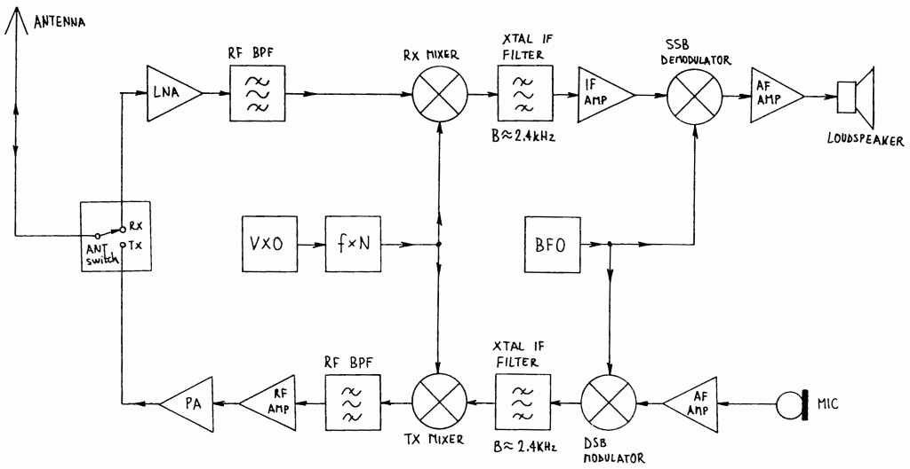
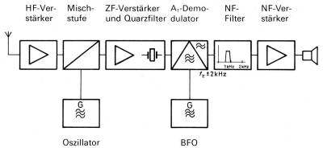
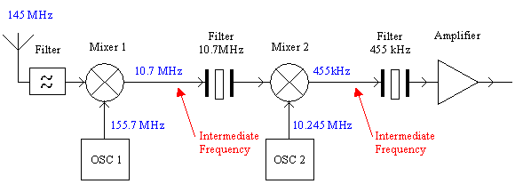

# HAM-Radio-transceiver-DA

**table of content**
- [HAM-Radio-transceiver-DA](#ham-radio-transceiver-da)
    - [Transceiver](#transceiver)
    - [CW-receive](#cw-receive)
    - [singleSideBand-receive](#singlesideband-receive)
    - [First Mixer](#first-mixer)
---

### Transceiver
Source: [Hamradio.si](https://lea.hamradio.si/~s53mv/zifssb/block.html)
  

### CW-receive
Source: [ShortwaveRadio.ch](http://www.shortwaveradio.ch/doku.php?id=de:prinzip)  
   
Morse signs, which arise from simply switching on and off a non-mobulated high frequency signal (A1) are not or are not in the headphones.At most perceived by slight noise.In order to make these morse signs audible, an oscillator signal must be added to the antenna signal, which differs around the frequency amount from the antenna signal, which is then to be heard as an audible frequency in the headphones.This oscillator, which is to be switched to telegraphy reception (referred to as A1, telegraphy), is referred to as the "telegraphia -covered" or BFO (Beat frequency oscillator).

As a rule, in addition to the switch for activating the BFO (partly referred to as operating mode of telegraphy or d.)

In the case of a side band excerpts (SSB), only one side band is broadcast by an AM signal, which consists of two identical symmetrical side tapes and the carrier signal in between, the performance of the transmission level can be used more efficiently by the use of the user signal and non-beam signal withoutInformation value is used.
In order to make the signal audible, an auxiliary carrier must be added to the sender in the recipient instead of the carrier signal.The BFO is also used for this function for simple SSB receivers.With the pitch controller, the distance of the auxiliary strap signal to the received side band signal must be chosen in such a way that the spokesman's stimemae sounds naturally, and neither the humming bear grumbles nor squeaks high frequency according to the type of Mickey Mouse.

---
### singleSideBand-receive
Source: [ShortwaveRadio.ch](http://www.shortwaveradio.ch/doku.php?id=de:prinzip)  
  
In high-quality receivers, the singe side band receiver is more technically complex.

The received individual side band without a carrier signal, which can hardly be demodulated with normal AM operating type, is mixed with two switchable different oscillator frequencies after implementation, which are at a fixed distance from the intermediate frequency.The upper side band (USB, Upper Sideband) or the lower side band (LSB, Lower Sideband) can then be received with corresponding specific filters.

SSB filters of 2.5 - 3.6 kHz bandwidth, which are dimensioned for optimal speech intelligibility, a signal impaired by neighboring channel disorders can be made understandable.

---
### First Mixer 
Source: [RFcandy](https://www.rfcandy.biz/communication/mc3362.html)  
  