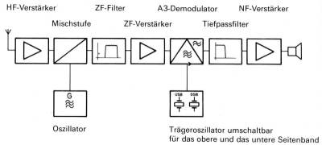

# HAM-Radio-transceiver-DA

### CW-Empfang
Source: [ShortwaveRadio.ch](http://www.shortwaveradio.ch/doku.php?id=de:prinzip)  
  
Morsezeichen, welche durch einfaches Ein- und Ausschalten eines nicht-mobulierten Hochfrequenzsignals entstehen (A1) werden im Kopfhörer nicht resp. höchstens durch leichtes Rauschen wahrgenommen. Um diese Morsezeichen hörbar zu machen, muss dem Antennensignal ein Oszillatorsignal beigemischt werden, welches sich um den Frequenzbetrag vom Antennensignal unterscheidet, der dann als hörbare Frequenz im Kopfhörer ertönen soll. Dieser, zum Telegraphieempfang (bezeichnet als A1, Telegraphie tonlos) zuzuschaltende Oszillator wird als „Telegraphieüberlagerer“ oder BFO (Beat Frequency Oscillator) bezeichnet.

In der Regel ist neben dem Schalter zum Aktivieren des BFO (teils als Betriebsart Telegraphie oder Tg. tonlos bezeichnet) auch ein Tonhöhenregler und bei älteren Geräten ein Pegelregler für das BFO-Signal vorhanden.

Bei Einseitenband-Aussendungen (SSB) wird von einem AM-Signal, welches aus zwei identischen symmetrischen Seitenbändern und dem dazwischen liegenden Trägersignal besteht, nur ein Seitenband ausgestrahlt, die Leistung der Sendeendstufe kann dadurch effizienter genutzt werden, indem die für Nutzsignal und nicht Trägersignal ohne Informationswert genutzt wird.
Um das Signal hörbar zu machen, muss anstelle des Trägersignals vom Sender im Empfänger ein Hilfsträger zugefügt werden. Für diese Funktion kommt bei einfachen SSB-Empfängern ebenfall der BFO zum Einsatz. Mit dem Tonhöhenregler muss der Abstand des Hilfsträgersignals zum empfangenen Seitenbandsignal so gewählt werden, dass die Stimem des Sprechers natürlich klingt, und weder der Brummbär brummelt noch nach Art von Mickey Mouse hochfrequent quietscht.

---
### Einseitenbandempfang
Source: [ShortwaveRadio.ch](http://www.shortwaveradio.ch/doku.php?id=de:prinzip)  
  
In hochwertigen Empfängern ist der Einseitenbandempfang technisch aufwendiger gelöst.

Das empfangene einzelne Seitenband ohne Trägersignal, welches bei normaler AM-Betriebsart kaum verständlich demoduliert werden kann, wird nach Umsetzung auf die Zwischenfrequenz mit zwei schaltbaren unterschiedlichen Oszillatorfrequenzen gemischt, welche in einem fixen Abstand zur Zwischenfrequenz liegen. Mit entsprechenden spezifischen Filtern kann dann wahlweise das obere Seitenband (USB, upper sideband) oder das untere Seitenband (LSB, lower sideband) empfangen werden.

Mit entsprechenden schmalbandigen, auf optimale Sprachverständlichkeit dimensionierten, SSB-Filtern von 2,5 - 3,6 kHz Bandbreite, kann ein schwaches von Nachbarkanalstörungen beeinträchtigtes Signal verständlich gemacht werden.