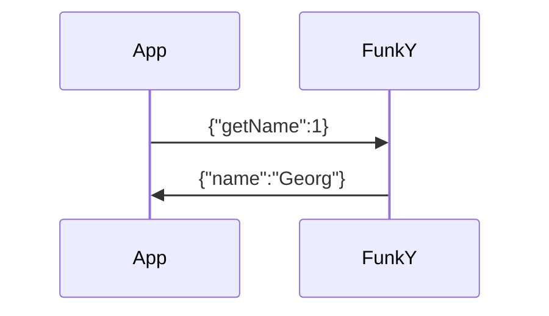

Request based system.

- [[#Get Functions with Return|Get Functions with Return]]
	- [[#Get Functions with Return#Frequency|Frequency]]
	- [[#Get Functions with Return#Voltage|Voltage]]
	- [[#Get Functions with Return#Name|Name]]
	- [[#Get Functions with Return#Call|Call]]
	- [[#Get Functions with Return#Temperature|Temperature]]
- [[#Example|Example]]

## Get Functions with Return

### Frequency
```JSON
{"getFrequency":1}
```
Returns:
```JSON
{"frequency":14.122100}
```
### Voltage
```JSON
{"getVoltage":1}
```
Returns battery voltage:
```JSON
{"voltage":11.1}
```
### Name
```JSON
{"getName":1}
```
Returns Operator Name:
```JSON
{"name":"Georg"}
```
### Call
```JSON
{"getCall":1}
```
Returns Operator Call sign:
```JSON
{"call":"OE8GKE"}
```
### Temperature
```JSON
{"getTemperature":1}
```
Returns PA temperature in C:
```JSON
{"temperature":56.2}
```

## Example

