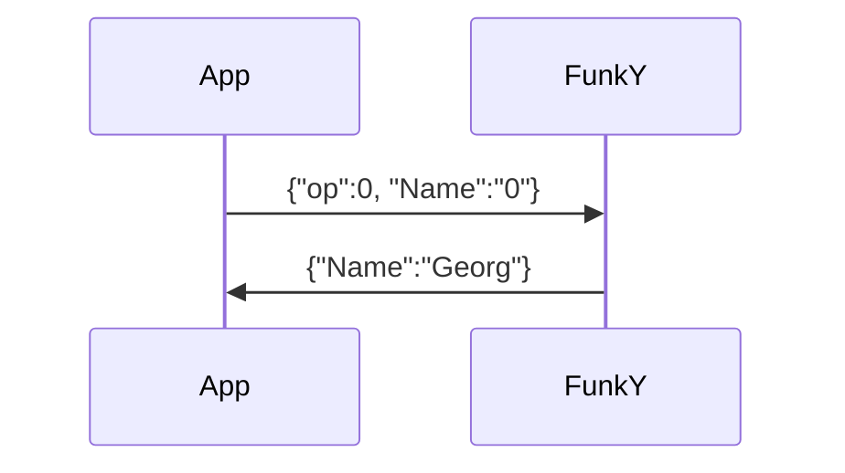
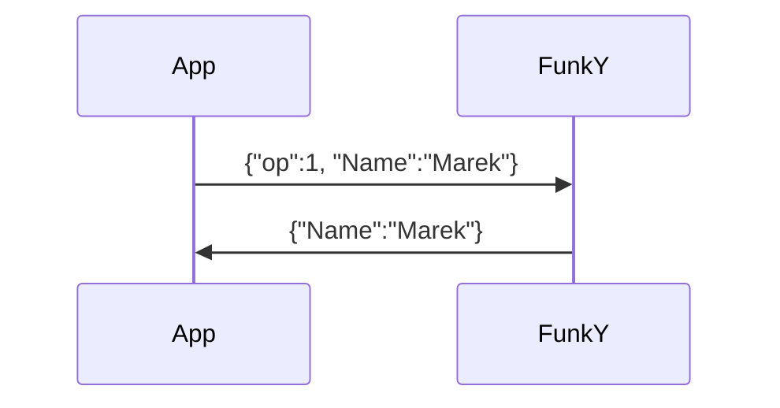

Request based system.

**Table of content**
- [Get Functions with Return](#get-functions-with-return)
- [Operations](#operations)
	- [Frequency](#frequency)
	- [Voltage](#voltage)
	- [Name](#name)
	- [Call](#call)
	- [Temperature](#temperature)
- [Example](#example)
	- [Get Value](#get-value)
	- [Set Value](#set-value)

## Get Functions with Return

## Operations
Wenn op = false/0:
```JSON
{"op":0}
```
get Values. 
<br>

--- 

Wenn op = true/1:
```JSON
{"op":1}
```
sets Values.

---

### Frequency
```JSON
{"op":0, "Frequency":1}
```
Returns:
```JSON
{"frequency":14.122100}
```
### Voltage
```JSON
{"op":0, "Voltage":1}
```
Returns battery voltage:
```JSON
{"Voltage":11.1}
```
### Name
```JSON
{"op":0, "Name":"0"}
```
Returns Operator Name:
```JSON
{"Name":"Georg"}
```
### Call
```JSON
{"op":0, "Call":"0"}
```
Returns Operator Call sign:
```JSON
{"Call":"OE8GKE"}
```
### Temperature
```JSON
{"op":0, "Temperature":1}
```
Returns PA temperature in C:
```JSON
{"Temperature":56.2}
```

## Example
### Get Value

### Set Value 
