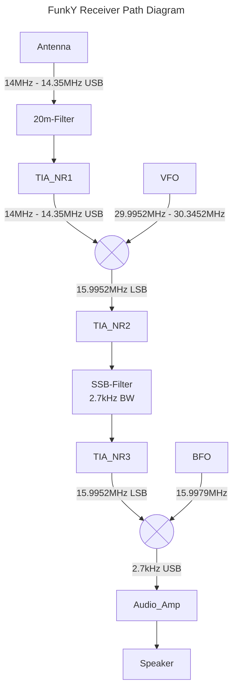

+++
title = 'Receiver'
+++

The receiver in this project is the most vital part of the transceiver. The Receiver is build as a Superhet receiver.

**table of content**
- [Graph of received signal](#graph-of-received-signal)
  - [FunkY Receiver Path Diagram](#funky-receiver-path-diagram)
- [Antenna Filtering](#antenna-filtering)
- [Small signal Amplifier](#small-signal-amplifier)
- [Mixers and Oscillator](#mixers-and-oscillator)
- [SSB Filter](#ssb-filter)
- [Demodulation](#demodulation)
- [Audio Amplifier](#audio-amplifier)

### Graph of received signal

Inspiration from [Land Boards](https://land-boards.com/blwiki/index.php?title=A_Termination_Insensitive_Amplifier_for_Bidirectional_Transceivers)

---
#### FunkY Receiver Path Diagram
This is a graph which shows the receiver path of the transceiver.

### Antenna Filtering 
The antenna captures the electromagnetic waves carrying the radio signals. Since at the antenna there are signals from various frequencies present and we don't want to get any problems with mirror Frequencies we have to filter out any unwanted frequencies.

**Band-Pass Filters:** The filters are used to limit the input signal to the target frequency band which in our case is the 20m Band ranging from 14MHz to 14.35MHz. These filters ensure that unwanted signals outside the ham radio's operating range are rejected early in the process, minimizing interference and improving selectivity.

Image Filter 20m           |  Lower Cutoff | Upper Cutoff
:-------------------------:|:-------------------------:|:-------------------------:
.jpeg)  |   | .jpeg)

### Small signal Amplifier

### Mixers and Oscillator

### SSB Filter 

### Demodulation

### Audio Amplifier
