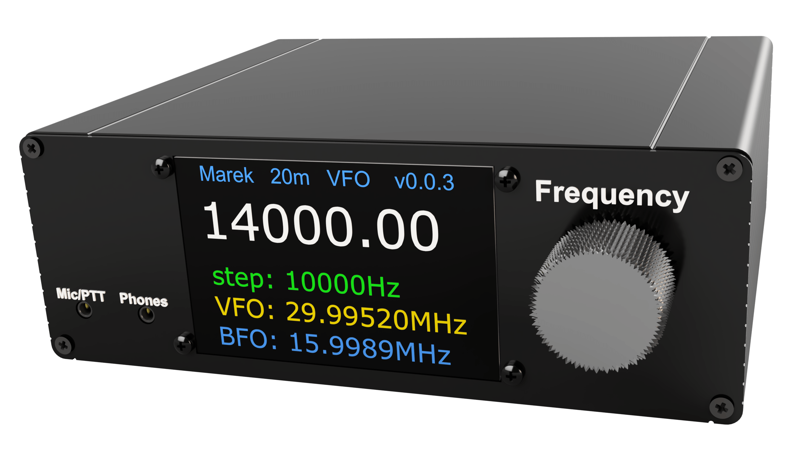

### Image of the FunkY

### What this is about
This Project is an analog amateur radio for the 20m (14MHz) band. The aim of this project is to get beginners and non beginners into building their own amateur radio stations. This project webpage is a detailed documentation on how every component works and how to measure them and put the ham radio transceiver together. 

#### Idea
Commercial radios are often too expensive, especially for beginners. For this reason, we have set ourselves the goal of offering a cheaper kit to be able to send and receive. ​

#### How it works
Values ​​such as reception and transmission frequencies are transmitted and controlled via Bluetooth via an app.​
These set frequencies are received via an antenna, filtered and mixed in order to then be output to the loudspeaker. ​

##### Implementation​
You should be able to create this kit using instructions and your own hardware blocks as well as HF circuits.​​